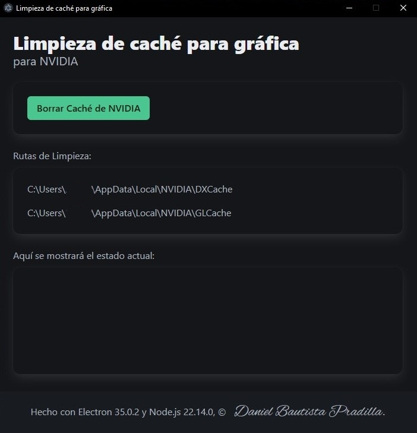

# App en electron para limpiar el cache de la tarjeta gráfica

Borra los archivos contenidos en las carpetas de DXCache y GLCache de NVIDIA en la ruta "C:\Users\NombreUsuario\AppData\Local\NVIDIA" para que la gráfica pueda volver a crear cachés de los juegos y aplicaciones en uso.

## Imágenes del proyecto

- **Vista del proyecto:**
  

## Empaquetado

Se usa https://github.com/electron/packager para realizar el empaquetado.

Comando de empaquetado:

```sh
npx electron-packager . Grafica-cacheClear --platform=win32 --arch=x64 --icon=assets/img/favicon.ico --overwrite --asar --ignore=ejecutable

```

1.  `.` indica el directorio actual como la ruta de tu aplicación.
2.  `Grafica-cacheClear` es el nombre de la aplicación.
3.  `--platform=win32` especifica que estás empaquetando para Windows.
4.  `--arch=x64` define la arquitectura de 64 bits.
5.  `--icon=assets/img/favicon.ico` establece el ícono de tu aplicación.
6.  `--overwrite` sobrescribe cualquier paquete existente con el mismo nombre.
7.  `--asar` activa la creación del archivo asar para compresión de los archivos de la aplicación.

### Notas:

ModClean es una herramienta diseñada para limpiar la carpeta node_modules eliminando archivos y directorios innecesarios que suelen ocupar espacio y ralentizar procesos como despliegues o empaquetado.

```sh
npx modclean --run

```

Árbol:

```sh
grafica_cache_clear/
├── index.html
├── main.js
├── preload.js
├── renderer.js
└── assets/
    ├── css/
    │   └──estilo.css
    ├── fonts/
    ├── img/
    └── marcas/
        └── nvidia.js
```
